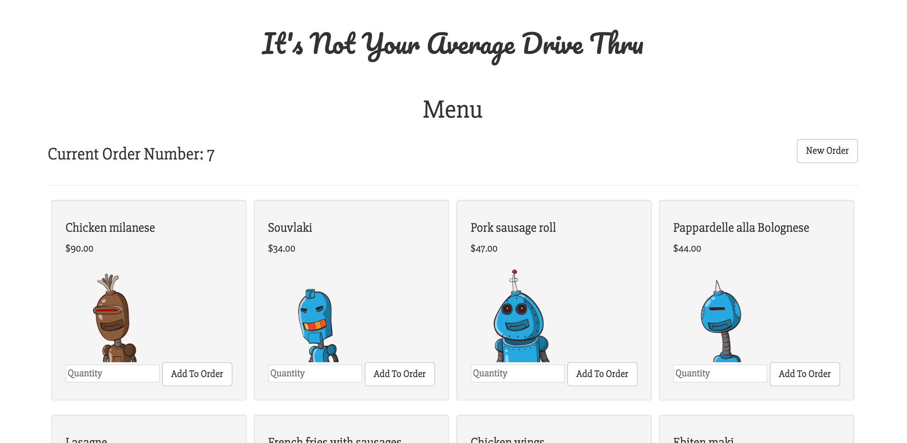
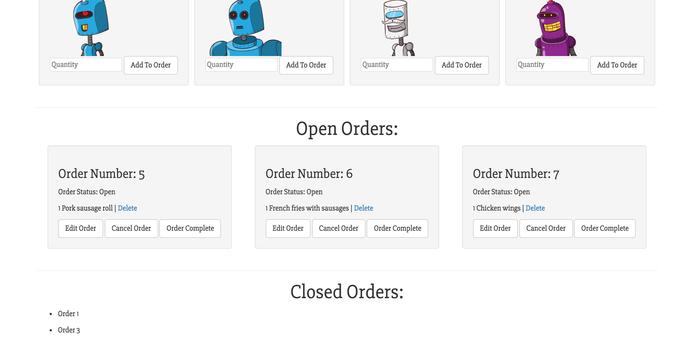

# Asia's Drive Through

## View Project at: https://fierce-headland-31121.herokuapp.com/products

## This is an application for a drive thru employee to manage orders.

#### By _**Asia Kane**_

Note: I chose to build the application using Rails and Postgres including using Rails views for the front-end because I wanted to be sure I had an MVP by the deadline.  My intent was to refactor using React for the front-end, but I did not have enough time to do so.  The application includes unit tests using rspec.  It is seeded with random images(avatars) and menu items using the Faker Gem.

## Technologies Used:
- Ruby on Rails
- Rspec
- Postgres

## Application Includes:

1. A visual menu where the drive-thru employee can select menu items to build the order and then send the order to the cooks.
2. Handling a case where someone has decided to change their order once they get to the window.
3. Handling a case where someone has decided to cancel an order once they get to the window.
4. The ability to view current open orders and then close them when they're handed to our happy customers.
5. An alert for the manager when the total number of open orders goes above 4.

## Further exploration
For further exploration, I plan to incorporate the following:
  - AJAX
    - Please view this project as an example of my use of AJAX
      - https://github.com/akane0915/higher-grounds-coffee3
  - User Integration Testing
  - React and ES6
    - Please view this project as an example of my use of React
      - https://github.com/akane0915/rails-interactive-storybook
      - https://interactive-storybook.herokuapp.com/
  - Additional JavaScript functionality
  - Please view this project as an example of my use of JS and jQuery
    - http://www.tomkaneart.com
    - https://github.com/akane0915/tom-kane-art-website

## Installation

In your terminal:
* `git clone https://github.com/akane0915/drive-thru`
* `cd drive-thru`
* Ensure you are running Ruby 2.4.1 and Rails 5.1.2 versions or later.
* `bundle install`
* Open another terminal window and type `postgres`.  Leave this window open.
* In your first terminal window type:
* `bundle exec rake db:create`
* `bundle exec rake db:setup`
* `bundle exec rake db:test:prepare`

## Development server

Run `bundle exec rails s` for a dev server. Navigate to `http://localhost:3000/`. The app will automatically reload if you change any of the source files.

## Running tests

This app includes unit and integration testing using RSpec.
Run `bundle exec rspec` in terminal to test.
